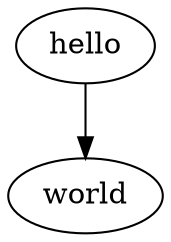

# Graphviz
Graphviz is an open source graph visualization software. It reads
a text file description of a graph and generates an image automatically.

Reference: [Graphviz - Graph Visualization Software](https://graphviz.org/)

## Usage
Graphviz provides many binaries for building the image:

| binary | description |
| ------ | ----------- |
| `dot` | filter for drawing directed graphs |
| `neato` | filter for drawing undirected graphs |
| `twopi` | filter for radial layouts of graphs |
| `circo` | filter for circular layout of graphs |
| `fdp` | filter for drawing undirected graphs |
| `sfdp` | filter for drawing large undirected graphs |
| `patchwork` | filter for squarified tree maps |
| `osage` | filter for array-based layouts |

I mostly use `dot`.
```bash
dot -Tpng graph.dot -o graph.png
```

## Example
**hello.dot**


```bash
dot -Tpng hello.dot -o hello.png
```

**hello.png**


## Useful Attributes
| Attribute | Description |
| --------- | ----------- |
| [rankdir](https://graphviz.org/docs/attrs/rankdir/) | Set direction of graph layout (`LR` / `TB`) |
| [label](https://graphviz.org/docs/attrs/label/) | Text label attached to objects |
